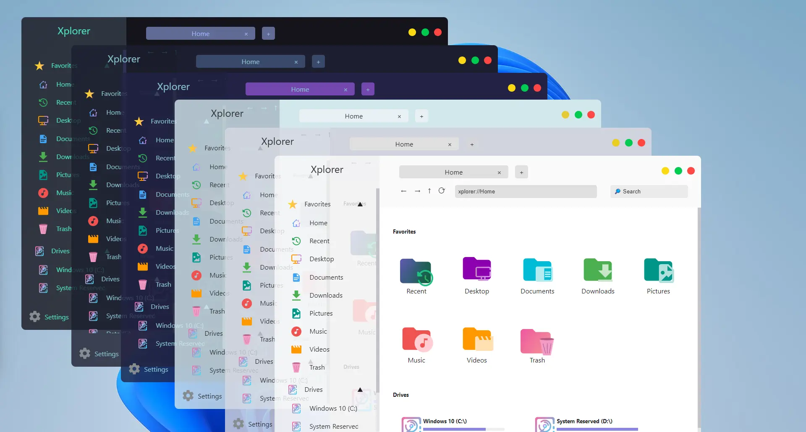
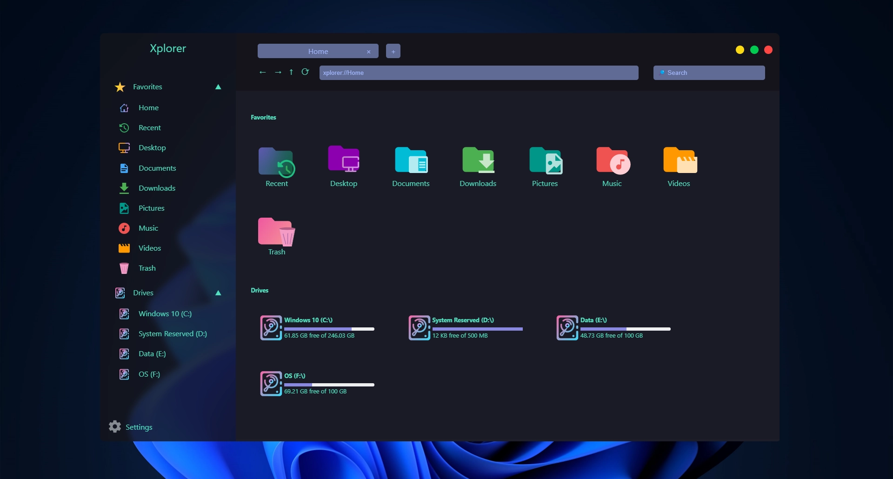
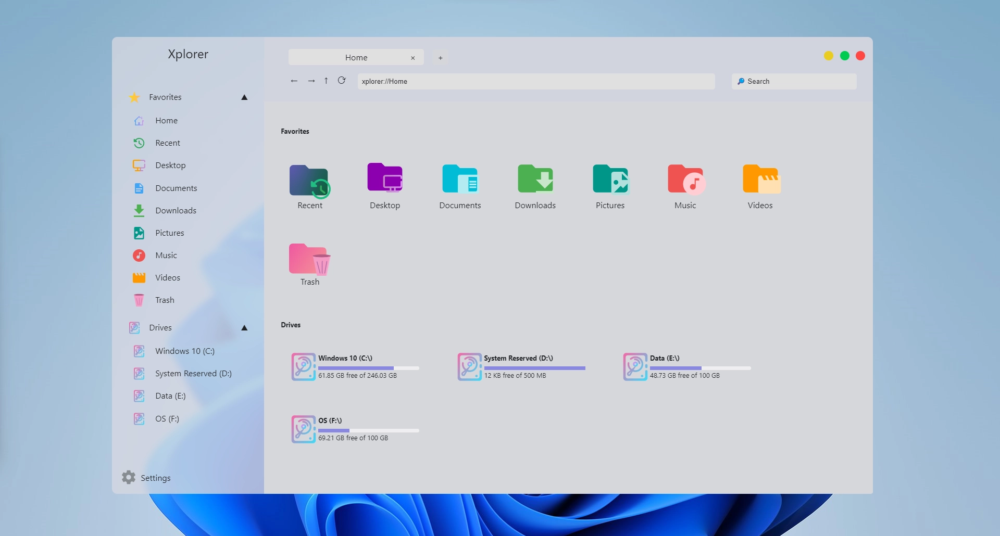
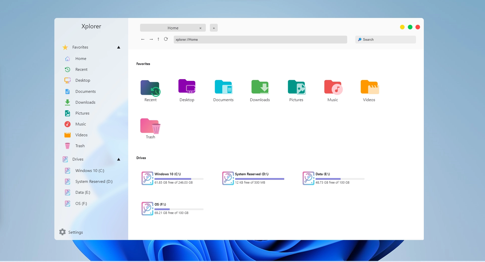
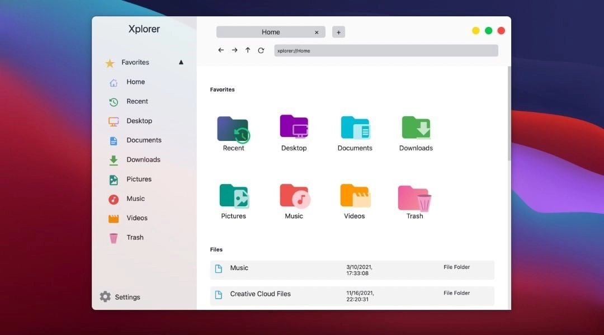
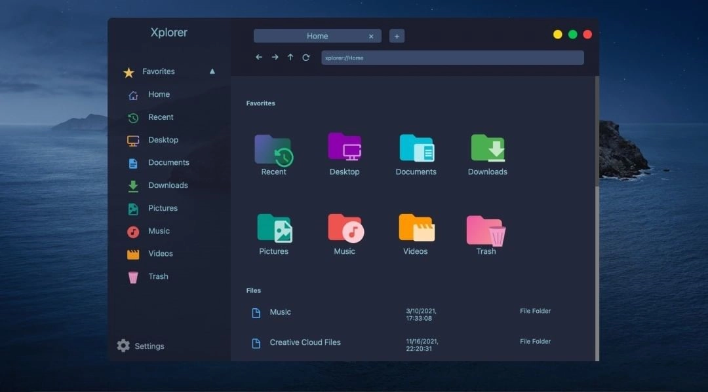
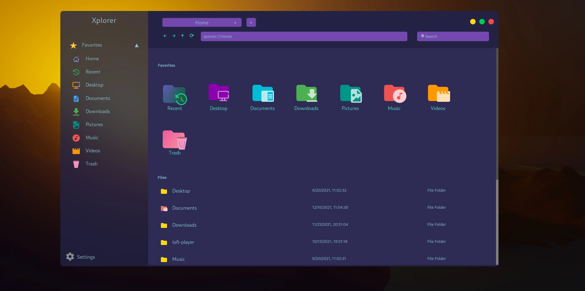

<div align="center">

</div>

<p align="center"><span><b>Xplorer</b>, a customizable, modern and cross-platform File Explorer.</span></p>
<h4 align="center"><span><a href="https://xplorer.space/docs/Community/support/">Supports</a></span> • <span><a href="https://github.com/kimlimjustin/xplorer/discussions">Discussions</a></span> • <span><a href="https://xplorer.space">Documentation</a></span> • <span><a href="https://discord.gg/MHGtSWvfUS">Discord</a></span></h4>

<div align="center">

[](https://github.com/kimlimjustin/xplorer/blob/master/LICENSE) [](https://github.com/kimlimjustin/xplorer/releases) [](https://github.com/kimlimjustin/xplorer/stargazers) [](https://github.com/kimlimjustin/xplorer/network/members) [](https://github.com/kimlimjustin/xplorer/watchers) [](https://github.com/kimlimjustin/xplorer/issues) [](https://github.com/kimlimjustin/xplorer/pulls) [](https://github.com/kimlimjustin) [](https://discord.gg/eM2hsDMtjq) [](https://ko-fi.com/kimlimjustin)

[](https://github.com/kimlimjustin/xplorer/releases) [](https://github.com/kimlimjustin/xplorer/releases) [](https://github.com/kimlimjustin/xplorer/releases) [](https://github.com/kimlimjustin/xplorer/releases)

</div>

---

# What is Xplorer?



<details>
<summary>
View More Screenshots
</summary>








</details>

Xplorer is a modern file explorer built from ground-up to be fully customizable to fit 2022's need. Besides, Xplorer is a cross-platform application powered by the web that is being wrapped using [Tauri](https://tauri.studio) framework in which you can run Xplorer on Windows, MacOS, or Linux without having much trouble. Some Xplorer's features in summary are:

-   It looks modern
-   Easy to use
-   [Cross-platform](https://xplorer.space/)
-   [File Preview](https://xplorer.space/docs/guides/operation/#preview-file), even for videos!
-   [Customizable](https://xplorer.space/docs/Extensions/theme/)
-   Supports multiple tabs
-   Most importantly, It's an Open Source Software (OSS)!

Xplorer is currently under heavy development. You can give your suggestions and feedback on our [Discussions](https://github.com/kimlimjustin/xplorer/discussions/) page. If you feel comfortable in writing code using Typescript and Rust, we highly encourage you to [contribute to this project](https://xplorer.space/docs/community/Contributing/).

---

## Project Roadmap

-   [x] File browsing and preview.
-   [x] Multiple tabs.
-   [x] Ability to continue the previous session on startup.
-   [ ] Extension.
    -   [x] Theme extension.
    -   [ ] Functions extension.
    -   [ ] Extension Marketplace.
-   [ ] Custom file categorization.
-   [ ] Multiple workspaces.
-   [ ] Web application.
-   [ ] Remote file (OneDrive, Google Drive, etc.)
-   [ ] File protection.
-   [ ] Custom file sorting and filtering.

Recommend us a feature by [opening an Discussion](https://github.com/kimlimjustin/xplorer/discussions) if you'd like to.

---

## Installation

If you want to install Xplorer on your system, you can download the installer for your operating system [on the release page](https://github.com/kimlimjustin/xplorer/releases). Please note that the current version is not stable yet, and you may encounter various bugs.

---

## Bug Reporting

If you find any bugs, please report it by submitting an issue on our [issue page](https://github.com/kimlimjustin/xplorer/issues) with a detailed explanation. Giving some screenshots would also be very helpful.

## Feature Request

You can also submit a feature request on our [issue page](https://github.com/kimlimjustin/xplorer) or [discussions](https://github.com/kimlimjustin/xplorer/discussions) and we will try to implement it as soon as possible. If you want to contribute to this project, please [contribute to this project](https://xplorer.space/docs/community/Contributing/).

---

## Common Problems

**NB: For common installation problems, please visit this page [here](https://xplorer.space/docs/install/#common-problems)**

<details>
<summary>
Opening folders like <code>Documents</code>, <code>Desktop</code>, <code>Downloads</code> makes Xplorer crash
</summary>

Try disabling the [`Extract exe file icon and make it as preview`](https://xplorer.space/docs/guides/setting/#extract-exe-file-icon-and-make-it-a-preview) option on `Preference` page on Settings.

Also, please make sure that Windows Defender isn't blocking Xplorer from accessing your documents.

</details>
<details>
<summary>
Xplorer crashes when opening a folder.
</summary>
Simply close and reopen Xplorer, Xplorer will fix itself. If it doesn't, please address an issue <a href="https://github.com/kimlimjustin/xplorer/issues">over here</a>

</details>

---

## Architecture

Xplorer is a cross-platform application built using the [Tauri](https://tauri.studio) framework. Tauri is based on the OS specific webview and Rust to work. Read about tauri [here](https://tauri.studio/en/docs/about/intro)

Xplorer is a polygot application. Xplorer relies on Rust api for file operations and TS, SCSS for the webview. Rust code are under `src-tauri` directory whereas the webview code are under `src` directory. The API that connects webview with the Rust code is under `src/Api` directory.

---

## Development

If you want to run this project in your local system, please follow this guide:

1. Fork this project

2. Clone the project to your local system using this command

3. Follow [this guide](https://tauri.studio/en/docs/getting-started/intro/#setting-up-your-environment) to set up Tauri environment

```sh
$ git clone https://github.com/<your_github_username>/xplorer.git
```

4. Change directory to the root directory of this project

```sh
$ cd xplorer
```

5. Install all dependencies using [`yarn`](https://yarnpkg.com/)

```sh
$ yarn install
```

6. Run the project in development mode. Please note that it might takes some times for Cargo to install dependencies for the first run.

```sh
$ yarn dev
```

### Gitpod for Xplorer's development

The easiest way to run Xplorer in Gitpod is to use the [Gitpod](https://gitpod.io/) service, all what you need to do is to click the button below and log in with your GitHub account. Afterwards, you will see a VS Code-like environment where you can start developing and pushing your changes. Please note that you may have to wait up to minutes to get Xplorer running on the poped up VNC tab.

## [](https://gitpod.io/#/https://github.com/kimlimjustin/xplorer)

## Contribution Guide

We highly encourage you to contribute to this project (even if you are a beginner). And if you finally want to contribute to this project, please read [our contribution guide](https://xplorer.space/docs/community/Contributing).

---

## LICENSE

[Apache-2.0](https://github.com/kimlimjustin/xplorer/blob/master/LICENSE)

---

## Love my work?

<a href='https://ko-fi.com/kimlimjustin' target='_blank'>
