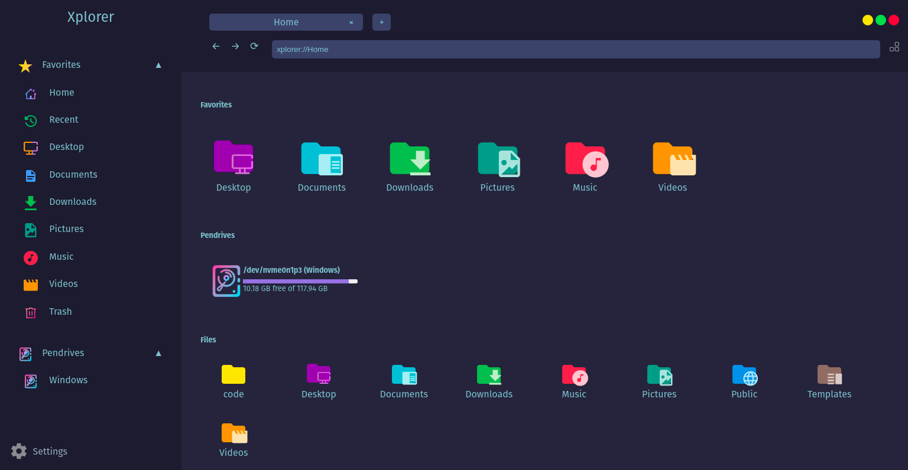
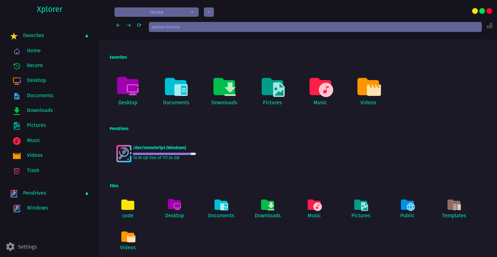
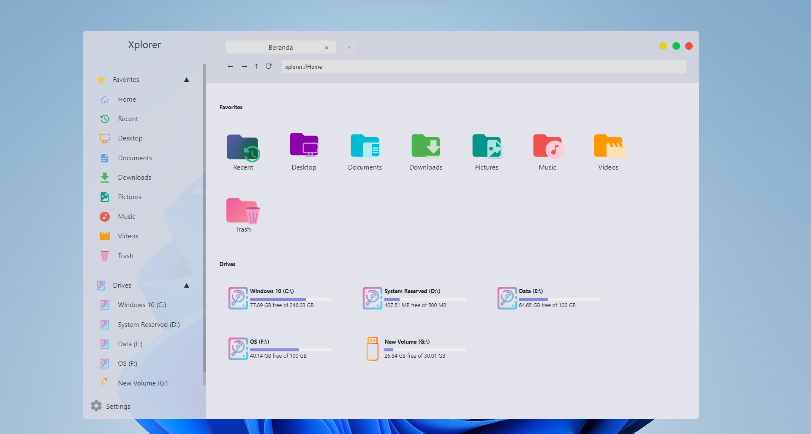
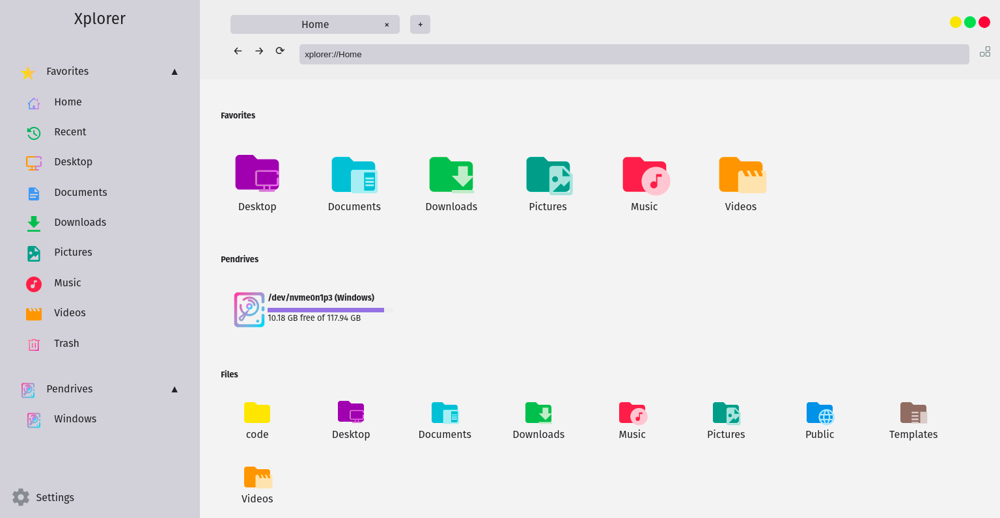

<div align="center">

</div>

<p align="center"><span><b>Xplorer</b>, a customizable, modern and cross-platform File Explorer.</span></p>
<h4 align="center"><span><a href="https://xplorer.vercel.app/community/support/">Supports</a></span> • <span><a href="https://github.com/kimlimjustin/xplorer/discussions">Discussions</a></span> • <span><a href="https://xplorer.vercel.app">Documentation</a></span></h4>

<div align="center">

[](https://github.com/kimlimjustin/xplorer/blob/master/LICENSE) [](https://github.com/kimlimjustin/xplorer/releases) [](https://github.com/kimlimjustin/xplorer/stargazers) [](https://github.com/kimlimjustin/xplorer/network/members) [](https://github.com/kimlimjustin/xplorer/watchers) [](https://github.com/kimlimjustin/xplorer/issues) [](https://github.com/kimlimjustin/xplorer/pulls) [](https://github.com/kimlimjustin) [](https://discord.gg/eM2hsDMtjq)

[](https://github.com/kimlimjustin/xplorer/releases) [](https://github.com/kimlimjustin/xplorer/releases) [](https://github.com/kimlimjustin/xplorer/releases) [](https://github.com/kimlimjustin/xplorer/releases)

</div>

---

# What is Xplorer?



<details>
<summary>
View More Screenshots
</summary>





</details>

Xplorer is a file explorer built from ground-up to be fully customizable. And even without any customization, it already looks modern!

Xplorer is a cross-platform application built using [Electron](https://www.electronjs.org/), and you can run it on Windows, MacOS, or Linux without having much trouble. One of the key feature is Xplorer allows you to preview the files you have directly inside Xplorer. And it's not only limited to picture or document preview, but also video preview.

To summarize, Xplorer's features contain:

-   It looks modern
-   Easy to use
-   Cross-platform
-   [File Preview](https://xplorer.vercel.app/docs/guides/operation/#preview-file), even videos!
-   Most importantly, Free and Open Source Software(FOSS), which means you can change components inside if you see fit
-   File preview, even for videos!
-   Most importantly: FOSS! Free and Open Source Software, which mean you can change the components inside if you see fit

Xplorer is currently under heavy development. You can give your suggestions and feedbacks in our [Discussions](https://github.com/kimlimjustin/xplorer/discussions/) page. If you feel comfortable in writing code using Typescript, we highly encourage you to [contribute to this project](https://xplorer.vercel.app/community/Contributing/).

---

## Installation

If you want to install Xplorer in your system, you can download the installer for your operating system [in the release page](https://github.com/kimlimjustin/xplorer/releases). Please note that the current version is not stable yet, and you may encounter various bugs.

---

## Bug Reporting

If you find any bug, please report it by submitting an issue in our [issue page](https://github.com/kimlimjustin/xplorer/issues) with detailed explanation. Giving some screenshots would also be very helpful.

---

## Common Problems

**NB: For installation common problems, please visit this page [here](https://xplorer.vercel.app/docs/install/#common-problems)**

<details>
<summary>
Xplorer keep loading and crashes.
</summary>
Try open cmd by typing <code>Win + R</code> and type <code>cmd</code>.
Enter following command:

```
wmic
```

If the output says the `wmic` is not recognized as internal or internal command, please follow the steps given on [this article](https://superuser.com/questions/1178674/wmic-is-not-recognized-as-an-internal-or-external-command-operable-program-or) or [this article](https://knowledge.informatica.com/s/article/156865?language=en_US).

Also, please make sure that windows defender isn't blocking Xplorer from accessing your documents.

</details>
<details>
<summary>
Opening folder like <kbd>Documents</kbd>, <kbd>Desktop</kbd>, <kbd>Downloads</kbd> makes Xplorer crash
</summary>

Disable the [`Extract exe file icon and make it as preview`](https://xplorer.vercel.app/docs/guides/setting/#extract-exe-file-icon-and-make-it-a-preview) setting.

Also, please make sure that windows defender isn't blocking Xplorer from accessing your documents.

</details>
<details>
<summary>
Xplorer is unstable after installing it.
</summary>
Simply restart, Xplorer will fix itself, if it doesn't, please address an issue <a href="https://github.com/kimlimjustin/xplorer/issues">over here</a>

</details>

---

## Development

If you want to run this project in your local system, please follow this guide:

1. Fork this project

2. Clone the project to your local system using this command

    `$ git clone https://github.com/<your_github_username>/xplorer.git`

3. Change directory to the root directory of this project

    `$ cd xplorer`

4. Install all dependencies using `yarn`

    `$ yarn install`

5. Run the project in development mode

    `$ yarn dev`

---

## Contribution Guide

We highly encourage you to contribute to this project (even if you are a beginner). And if you finally want to contribute to this project, please read [our contribution guide](https://xplorer.vercel.app/community/Contributing).

---

### Gitpod for Xplorer's development

Gitpod is a Ready-to-Code environment in which you don't need to worry about dependency errors or lagging your computer. Hit the button below and log in to GitHub with your GitHub account. Then, after it loads, you end up with a VS Code-like environment where you can start developing and pushing your changes.

**Very Important Note: Remember to reload the Gitpod website after it loads up since it won't start the servers immediately, but by reloading, you can get it started. If you are developing the app, go to the Remote Explorer on the sidebar and visit port _6080_ which opens the noVNC app server. If you are developing the docs, go to the Remote explorer but instead of port 6080, visit port _3000_. You can edit normally as you do in VS Code, but if you want to use it locally, click the hamburger menu button and click _Open in VS Code_.**

[](https://gitpod.io/#/https://github.com/kimlimjustin/xplorer)

---

## LICENSE

[Apache-2.0](https://github.com/kimlimjustin/xplorer/blob/master/LICENSE)
